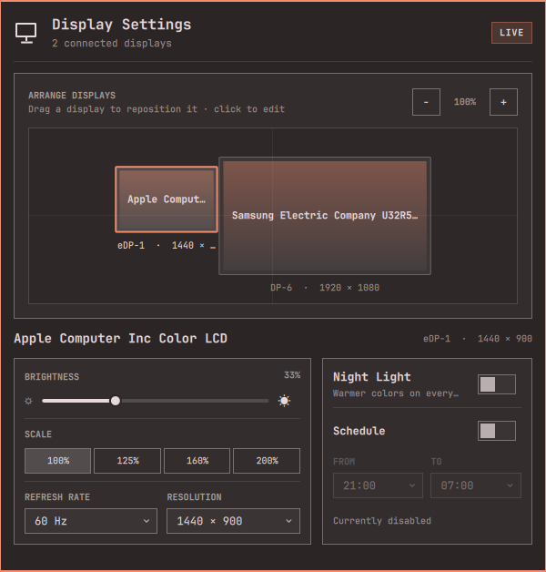

# Display Settings

An Omarchy shell plugin for arranging displays and tuning per-monitor settings from the bar.



## Features

- Select and drag the displays reported by Hyprland to arrange the desktop.
- Represent monitors at their physical proportions when EDID dimensions are available.
- Change per-display resolution, scale, and refresh rate using modes supported by the monitor.
- Control brightness through Omarchy's internal-backlight, DDC/CI, and Apple display support.
- Enable Night Light immediately or schedule it for a daily time range.
- Apply changes live and persist display settings across login and reboot.

Display configuration is saved in a marked `omarchy-display` block in `~/.config/hypr/monitors.lua`. The original file is backed up to `~/.config/omarchy/monitors.lua.before-display-settings` before the first write.

Enabling the Night Light schedule backs up `~/.config/hypr/hyprsunset.conf`, installs the selected schedule, and enables the existing `hyprsunset` user service. Disabling the schedule restores that backup.

Brightness is shown as unavailable when the selected monitor does not expose a supported control method.

## Requirements

- Omarchy Quattro with its standard `omarchy`, `omarchy-shell`, `hyprctl`, `jq`, Bash, and user-systemd tools.
- Brightness hardware supported by `omarchy brightness display`; unsupported monitors remain available for arrangement, scale, and refresh-rate controls.
- The standard `hyprsunset` user service for Night Light scheduling.

No additional packages, network services, root privileges, or background daemons are required.

## Configuration safety

Installation does not modify display or Night Light configuration. The plugin writes configuration only after an explicit arrangement, resolution, scale, refresh-rate, or schedule action in the panel. It creates the backups described above before the first corresponding write and rolls back a rejected Hyprland configuration automatically.

## Installation

Install directly from the public GitHub repository and add the widget to your bar:

```bash
omarchy plugin add https://github.com/aminmarashi/omarchy-display.git --enable
```

Open **Display Settings** from the display icon in the Omarchy bar. To install a newer release later, run:

```bash
omarchy plugin update omarchy-display --yes
```

## Uninstallation

Remove the widget and its installed plugin files:

```bash
omarchy plugin remove omarchy-display --yes
```

Removal leaves the last explicitly applied display settings in place. Any backups created by the plugin remain available at `~/.config/omarchy/monitors.lua.before-display-settings` and `~/.config/omarchy/hyprsunset.conf.before-display-settings` if you want to restore them before removing the plugin.

## Test

```bash
./tests/display-settings-test.sh
omarchy plugin validate .
```

## Author

[Amin Marashi](https://amin.codes)

## License

MIT
